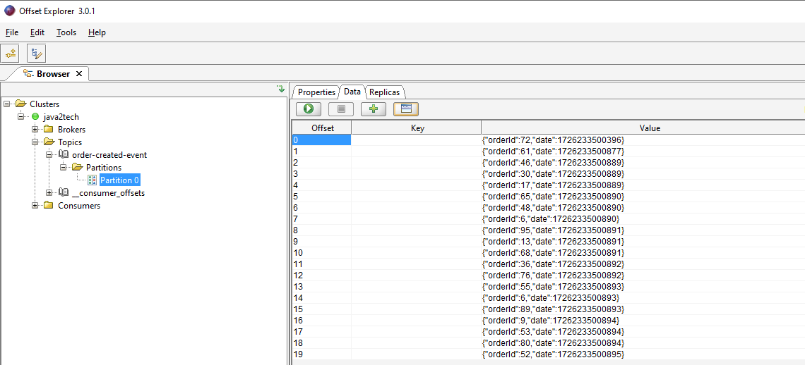
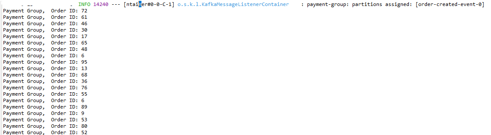
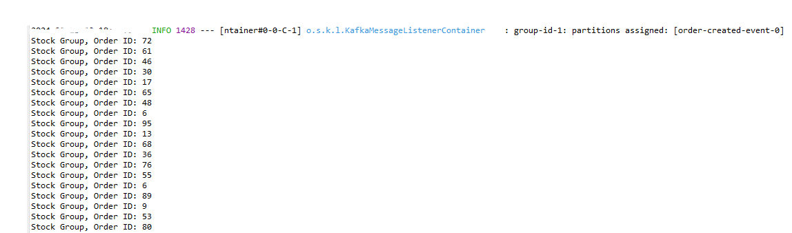

### Spring Kafka order services parallel communication.
- The demo project with Spring boot & Apache Kafka for Order Processing services for paallel processing concept. 

## Prerequisites
- Spring Boot (2.7.5)
- Maven 
- Java (11)
- Libraries:
  * starter-web 
  * kafka
  * lombok/logback

  
## START THE KAFKA ENVIRONMENT:
- NOTE: Local environment must have Java 8+ installed.

- Kafka Servers Start (local: eg. C:\kafka_2.13-3.7.0) with zookeeper.
* 1) .\bin\windows\zookeeper-server-start.bat .\config\zookeeper.properties
* 2) .\bin\windows\kafka-server-start.bat .\config\server.properties

## Run applications (3 REST APIs) and Call following REST API
- POST Call: http://localhost:9002/kafka/v1/orders/{totalOrder}

- Kafka Offset Explorer View

- Payment Service Log

- Stock Service Log

